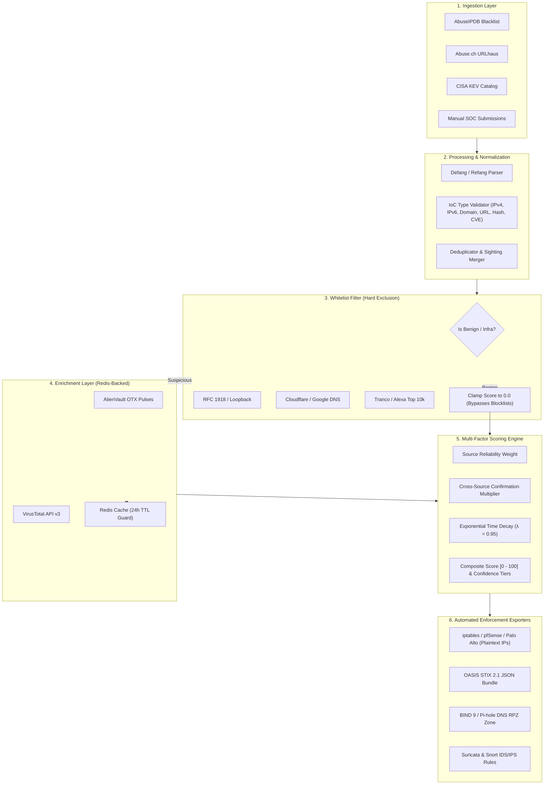

# Automated Threat Intelligence Aggregator & Feed Scoring Engine

[](https://github.com/ravishkarathnayaka/Automated-Threat-Intelligence-Aggregator-Feed-Scoring-Engine/actions)
[](https://github.com/ravishkarathnayaka/Automated-Threat-Intelligence-Aggregator-Feed-Scoring-Engine/actions)
[](https://www.python.org/)
[](LICENSE)
[](https://oasis-open.github.io/cti-documentation/)
[-brightgreen.svg)]()

Production-grade Cyber Threat Intelligence (CTI) engine built for Security Operations Centers (SOC) and Cyber Threat Intelligence teams. 

Raw threat feeds are notoriously noisy, unstandardized, and prone to costly false positives. This system automates the complete intelligence lifecycle: it ingests indicators across open-source and STIX/TAXII feeds, normalizes and deduplicates Indicators of Compromise (IoCs), enforces strict RFC/DNS false-positive filtration, enriches indicators via threat intelligence APIs, calculates a multi-factor confidence score (0–100), and exports real-time enforcement rules (**Suricata**, **Snort**, **iptables/pfSense firewall lists**, and **DNS Response Policy Zones**).

---

## 🏛️ System Architecture



---

## 📐 Scoring Methodology & Mathematical Formulation

The engine computes a transparent, auditable confidence score for every indicator:

$$\text{Composite Score} = \min\left(100.0, \, \left(\text{Base Weight} \times C_{\text{cross}} \times D(t)\right) + \Delta_{\text{enrich}}\right)$$

Where:
* **$\text{Base Weight}$**: Determined by the highest-fidelity reporting source ($W_{\text{source}} \times 70.0$ base points):
  - **CISA KEV** ($W = 1.00$): Authoritative federal alert of weaponized vulnerabilities.
  - **URLhaus** ($W = 0.85$): Active malware distribution endpoints verified by Abuse.ch.
  - **AbuseIPDB** ($W = 0.85$): High-confidence crowd-sourced malicious IP reports.
  - **SOC Manual Entry** ($W = 0.90$): Confirmed incident-response indicators.
  - **Generic / Community Feed** ($W = 0.60$): Baseline feeds.
* **$C_{\text{cross}}$ (Cross-Source Confirmation Factor)**: Multiplier applied when an indicator is independently reported across separate feeds:
  - $1\text{ Source}: 1.00\times$
  - $2\text{ Independent Feeds}: 1.25\times$
  - $3\text{ Independent Feeds}: 1.45\times$
  - $4+\text{ Independent Feeds}: 1.60\times$
* **$D(t)$ (Exponential Time Decay Factor)**: Measures indicator freshness based on days elapsed since $t_{\text{last\_seen}}$:
  $$D(t) = \lambda^{\Delta t} = 0.95^{\text{Days Old}}$$
* **$\Delta_{\text{enrich}}$ (Enrichment Boost)**:
  - VirusTotal detections ($\ge 10$ malicious engines: $+10.0$ pts; $\ge 3$ engines: $+5.0$ pts).
  - AlienVault OTX pulses ($\ge 5$ pulses: $+8.0$ pts; $\ge 1$ pulse: $+4.0$ pts).
* **Hard Whitelist Override**: If an indicator matches RFC 1918 private subnets, critical public DNS resolvers (`8.8.8.8`, `1.1.1.1`), or top Alexa/Tranco domains (`google.com`, `microsoft.com`), the score is **strictly clamped to 0.0**, permanently preventing false-positive blocking.

### Categorical Confidence Tiers

| Tier | Score Range | Action Recommended |
| :--- | :--- | :--- |
| **CRITICAL** | $85.0 - 100.0$ | Automated inline drop at firewall / DNS sinkholing |
| **HIGH** | $70.0 - 84.9$ | Automated perimeter blocklist / SIEM alert correlation |
| **MEDIUM** | $40.0 - 69.9$ | SIEM log enrichment / Tier-2 threat hunting queue |
| **LOW / BENIGN** | $0.0 - 39.9$ | Suppressed / whitelisted / monitor only |

---

## 📁 Repository Directory Layout

```text
├── .github/
│   └── workflows/
│       ├── ci.yml               # Code linting (ruff), mypy typing, pytest test suite
│       └── security-scan.yml   # Vulnerability scanning (Trivy) and secrets (Gitleaks)
├── docker/
│   ├── Dockerfile               # Multi-stage Python 3.11 production image
│   ├── docker-compose.yml       # PostgreSQL 16, Redis 7, FastAPI Engine, and Worker
│   └── .env.example             # Template for optional external API keys
├── cti_core/
│   ├── __init__.py
│   ├── database.py              # SQLAlchemy 2.0 async engine (SQLite / PostgreSQL dual-support)
│   ├── mock_data.py             # Synthetic high-fidelity IoC dataset for 100% offline verification
│   ├── pipeline.py              # End-to-end ingestion and orchestration pipeline
│   ├── worker.py                # Scheduled background sync worker
│   ├── models/
│   │   ├── indicator.py         # SQLAlchemy & Pydantic IoC schemas (IP, Domain, URL, Hash, CVE)
│   │   └── stix_schema.py       # STIX 2.1 serialization models and pattern compiler
│   ├── collectors/
│   │   ├── base.py              # Abstract collector with rate limiting and exponential backoff
│   │   ├── abuseipdb.py         # Ingestion client for AbuseIPDB blacklist
│   │   ├── urlhaus.py           # Ingestion client for Abuse.ch URLhaus malware links
│   │   └── cisa_kev.py          # Ingestion client for CISA Known Exploited Vulnerabilities
│   ├── processors/
│   │   ├── normalizer.py        # Defangs/refangs IoCs, validates IPv4/IPv6, domains, and hashes
│   │   ├── deduplicator.py      # Deduplicates records and merges multi-feed sighting metadata
│   │   └── whitelist_filter.py  # Filters RFC 1918, Cloudflare/Google DNS, and Tranco Top 10k
│   ├── enrichment/
│   │   ├── cache.py             # Redis-backed cache with in-memory TTL fallback
│   │   ├── otx_enricher.py      # AlienVault OTX pulse queries and caching
│   │   └── virustotal_enricher.py # VirusTotal API v3 queries with rate limiting guard
│   ├── scoring/
│   │   └── scoring_engine.py    # Multi-factor confidence scoring algorithm
│   └── exporters/
│       ├── stix_exporter.py     # OASIS STIX 2.1 JSON bundle generator
│       ├── firewall_blocklist.py # Plaintext IP blocklist formatted for iptables/pfSense
│       ├── dns_rpz_exporter.py  # DNS Response Policy Zone (RPZ) file for BIND 9 / Pi-hole
│       └── rules_exporter.py    # Suricata and Snort IDS/IPS rule generator
├── api/
│   ├── main.py                  # FastAPI entry point with CORS and startup lifecycle
│   └── routers/
│       ├── indicators.py        # Query and submit IoCs with filtering and pagination
│       └── exports.py           # Stream dynamic blocklists, STIX bundles, and rules
├── tests/
│   ├── test_normalizer.py       # Unit tests for defanging, refanging, and format parsing
│   ├── test_scoring_engine.py   # Unit tests for scoring math, confirmation factors, and decay
│   ├── test_whitelist_filter.py # Unit tests ensuring infrastructure (8.8.8.8) is never blocked
│   ├── test_stix_exporter.py    # Unit tests verifying STIX 2.1 schema compliance
│   └── test_api.py              # Integration tests for FastAPI query and export endpoints
├── pyproject.toml               # Build system, pytest, mypy, and ruff configs
├── requirements.txt             # Production and test dependencies
└── README.md                    # System documentation
```

---

## 🚀 Quickstart Guide

### Option 1: Run via Docker Compose ($0 Setup with PostgreSQL & Redis)

1. Clone repository and navigate to the docker folder:
   ```bash
   git clone https://github.com/ravishkarathnayaka/Automated-Threat-Intelligence-Aggregator-Feed-Scoring-Engine.git
   cd Automated-Threat-Intelligence-Aggregator-Feed-Scoring-Engine/docker
   ```

2. (Optional) Configure environment variables:
   ```bash
   cp .env.example .env
   # Edit .env if you wish to provide free API keys for AbuseIPDB, OTX, or VirusTotal.
   # If left blank, the system automatically runs using zero-cost public feeds & synthetic mock data!
   ```

3. Launch the containerized stack:
   ```bash
   docker compose up -d --build
   ```

4. Verify service health:
   - Interactive OpenAPI Documentation: [http://localhost:8000/docs](http://localhost:8000/docs)
   - Service Health Status: [http://localhost:8000/health](http://localhost:8000/health)

---

### Option 2: Run Locally ($0 Standalone without Docker)

1. Create a Python 3.11+ virtual environment:
   ```bash
   python -m venv venv
   # On Windows:
   venv\Scripts\activate
   # On Linux/macOS:
   source venv/bin/activate
   ```

2. Install dependencies:
   ```bash
   pip install -r requirements.txt
   ```

3. Launch FastAPI server with SQLite:
   ```bash
   uvicorn api.main:app --reload --host 127.0.0.1 --port 8000
   ```
   *The application automatically initializes `cti_engine.db` and populates synthetic threat intelligence feeds on startup.*

---

### Option 3: Launch Web Portal Frontend Locally

To explore the **Sentinel Cyber-Telemetry Web Portal** on your workstation:

```bash
# Option A: Python simple HTTP server
python -m http.server 3000 -d web

# Option B: Node / npx serve
npx serve web
```
Open [http://localhost:3000](http://localhost:3000) in your browser. The portal automatically links to your local FastAPI backend on port 8000 when active, or operates in standalone showcase mode if the API is offline.

---

### Option 4: Deploy Frontend to Vercel ($0 Public Showcase)

The repository includes a root `vercel.json` pre-configured for static deployment on Vercel:

1. **Via Vercel CLI**:
   ```bash
   npm i -g vercel
   vercel
   ```
2. **Via GitHub Integration**:
   - Push this repository to GitHub.
   - Go to [vercel.com](https://vercel.com) $\rightarrow$ **Add New Project** $\rightarrow$ Import this repository.
   - Root Directory: `./` (or leave default). Vercel reads `vercel.json` and automatically deploys the `web/` directory.
   - Click **Deploy**! Visitors can interact with live IoC search, run the scoring math sandbox, inspect STIX 2.1 schemas, and download firewall blocklists immediately.

---

## 🛡️ Testing & Verification

Run the comprehensive unit and integration test suite:

```bash
pytest -v
```

Run test suite with test coverage reporting:
```bash
pytest --cov=cti_core --cov=api --cov-report=term-missing tests/
```

Execute static code checks:
```bash
# Code linting
ruff check .

# Static type verification
mypy cti_core api
```

---

## 📡 API Usage & Example Curl Commands

### 1. Query High-Confidence Malicious IPs
Retrieve all IPv4/IPv6 indicators with a confidence score of $\ge 80$:

```bash
curl -X GET "http://localhost:8000/api/v1/indicators?type=ip&min_score=80" -H "Accept: application/json"
```

*Example Response:*
```json
[
  {
    "id": "7867fa7d-fb22-4217-bf41-482bc6ffaa80",
    "value": "185.220.101.5",
    "normalized_value": "185.220.101.5",
    "type": "ipv4",
    "confidence_score": 98.6,
    "confidence_tier": "CRITICAL",
    "severity": "critical",
    "tags": ["arm", "botnet", "brute-force", "mozi", "ssh-scan", "tor-exit"],
    "is_whitelisted": false,
    "sources": [
      {
        "source_name": "abuseipdb",
        "confidence": 100.0,
        "reported_at": "2026-09-13T18:17:00Z",
        "reference_url": "https://www.abuseipdb.com/check/185.220.101.5"
      },
      {
        "source_name": "urlhaus",
        "confidence": 95.0,
        "reported_at": "2026-09-13T19:17:00Z",
        "reference_url": "https://urlhaus.abuse.ch/browse/"
      }
    ],
    "score_breakdown": {
      "source_weight": 0.85,
      "cross_source_factor": 1.25,
      "decay_factor": 0.9995,
      "enrichment_boost": 18.0,
      "final_score": 98.6,
      "tier": "CRITICAL",
      "is_whitelisted": false
    }
  }
]
```

### 2. Download Firewall IP Blocklist (iptables / pfSense / Palo Alto)
Pull a dynamic newline-delimited blocklist of confirmed threats (Score $\ge 70$):

```bash
curl -X GET "http://localhost:8000/api/v1/export/firewall.txt?min_score=70"
```

*Output sample:*
```text
# =====================================================================
# Automated Threat Intelligence Firewall Blocklist
# Generated: 2026-09-13 18:20:00 UTC
# Minimum Confidence Score Threshold: 70.0
# Total Blocked IPs: 2
# Compatible with: iptables, pfSense, Palo Alto EDL, Fortinet Threat Feeds
# =====================================================================
185.220.101.5
194.26.29.112
```

### 3. Export OASIS STIX 2.1 JSON Bundle
Export standardized threat intelligence objects for SIEM (Splunk, Microsoft Sentinel) or SOAR platforms:

```bash
curl -X GET "http://localhost:8000/api/v1/export/stix.json?min_score=50"
```

*Output sample:*
```json
{
  "type": "bundle",
  "id": "bundle--3d7b88aa-89c0-424f-9e66-6b22f026a268",
  "objects": [
    {
      "type": "indicator",
      "spec_version": "2.1",
      "id": "indicator--e5a61b8f-124b-4890-84dc-6ba9fe927110",
      "name": "Threat Indicator: 185.220.101.5",
      "pattern": "[ipv4-addr:value = '185.220.101.5']",
      "pattern_type": "stix",
      "pattern_version": "2.1",
      "valid_from": "2026-09-13T18:17:00.000000Z",
      "confidence": 98,
      "labels": ["tor-exit", "ssh-scan", "mozi"]
    }
  ]
}
```

### 4. Export DNS Response Policy Zone (RPZ)
Stream standard RFC DNS RPZ rules for BIND 9 or Pi-hole:

```bash
curl -X GET "http://localhost:8000/api/v1/export/dns-rpz.zone?min_score=70"
```

*Output sample:*
```zone
; DNS Response Policy Zone (RPZ) for BIND / Pi-hole / Unbound
$TTL 300
@ IN SOA localhost. root.localhost. ( 2026091318 3600 1800 604800 300 )
@ IN NS localhost.

c2-beacon.darknet-ops.cc CNAME .
*.c2-beacon.darknet-ops.cc CNAME .
evil-payload-distribution.xyz CNAME .
*.evil-payload-distribution.xyz CNAME .
```

### 5. Export Suricata IDS/IPS Rules
```bash
curl -X GET "http://localhost:8000/api/v1/export/suricata.rules?min_score=75"
```

### 6. Manually Submit an Indicator for Real-Time Normalization & Scoring
Submit an obfuscated or defanged IoC:

```bash
curl -X POST "http://localhost:8000/api/v1/indicators" \
     -H "Content-Type: application/json" \
     -d '{
       "value": "hxxps://stealer-command-gate[.]cc/api",
       "source_name": "soc_incident_response",
       "tags": ["stealer", "c2", "urgent"]
     }'
```

---

## 📄 License

Distributed under the MIT License. See [LICENSE](LICENSE) for more information.
